# RemoteStick
**RemoteStick** - это клиент-серверное программное обеспечение для удалённого управления персональным компьютером. Оно состоит из серверного приложения RemoteStickServer, которое  работает на компьютере под ОС Windows, и клиентского - RemoteStick, которое запускается со смартфона под ОС Android.

**Клиентское приложение** имеет следующие **модули удалённого управления компьютером**:
-	модуль подключения к ПК;
-	модуль управления действиями мыши;
-	модуль клавиатуры;
-	модуль специальной клавиатуры;
-	модуль управления воспроизведением медиафайлов;
-	модуль демонстрации презентаций
-	модуль выполнения команд браузера;
-	модуль управления режимами активности ПК.

**Серверное приложение** на компьютере будет открывает и слушает порт, принимает клиента и выполняет все команды, которые он посылает.

Чтобы начать пользоваться системой, необходимо запустить серверное приложение RemoteStickServer на компьютере, а затем подключиться к нему со смартфона через приложение RemoteStick.

**Подключение** со смартфона к серверу **возможно через любой из трёх способов**:
- нажатие на одно из доступных устройств поблизости, на которых запущен сервер, в соотвествующем списке;
- подключение через историю недавних устройств;
- ввод IP-адреса сервера вручную (IP-адрес компьютера отображается в окне серверного приложения сразу после запуска);

При входе в приложение RemoteStick пользователь попадает на **экран подключения к компьютеру**. В верхней части отображается список доступных в сети устройств, на которых запущен сервер. Список обновляется в фоновом режиме. В нижней части экрана располагается история подключений к устройствам. С помощью неё пользователь может быстро подключиться к ПК, не дожидаясь, пока он отобразится в списке доступных устройств. Чтобы ввести IP-адрес вручную, необходимо нажать на иконку плюсика. После этого откроется экран подключения по IP и автоматически появится клавиатура для ввода IP-адреса сервера. Чтобы свести к минимуму число ошибок пользователя, на поле установлен специальный фильтр IP-адреса. Нажать кнопку «Подключиться» можно только тогда, когда адрес введён корректно.

 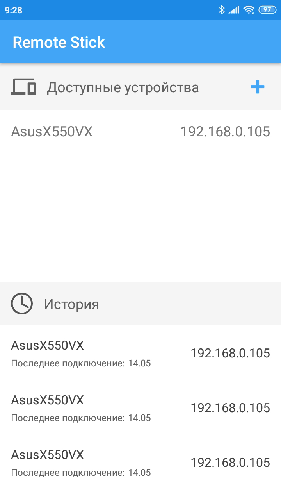
 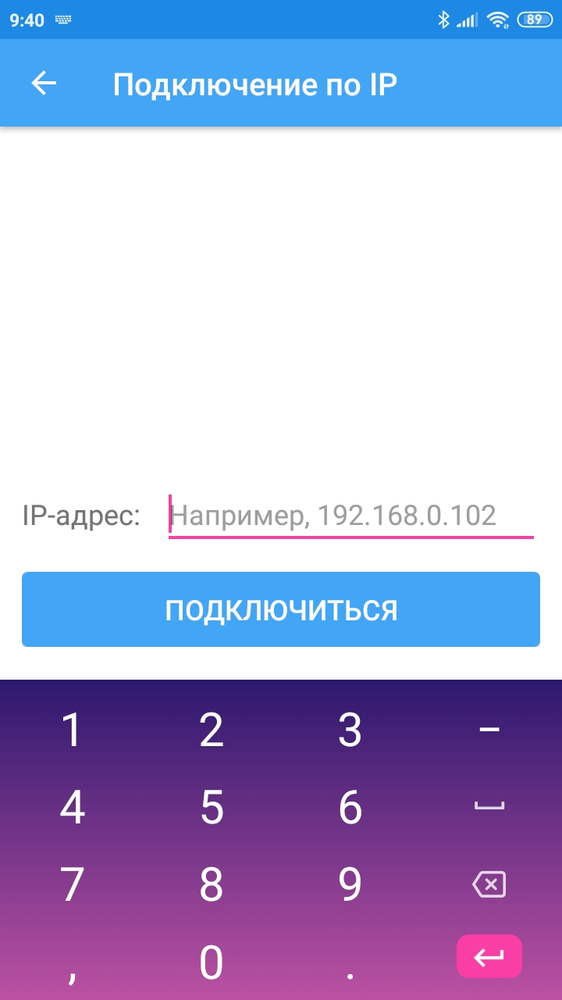

После нажатия кнопки «Подключиться» на данном экране или после нажатия на элемент списка в доступных или ранее подключённых устройствах будет произведено подключение к компьютеру. Если подключение выполнено успешно, на экране появится всплывающее уведомление с указанием сетевого имени сервера. В случае ошибки появится всплывающее уведомление с указанием причины её возникновения.

После успешного подключения к компьютеру происходит переход к **экрану удалённого управления**. По умолчанию перед пользователем в полноэкранном режиме открывается **модуль управления действиями мыши**, который представляет собой большое поле, имитирующее сенсорную панель в ноутбуках. Все остальные модули изначально скрыты.

Работая с полем, как с тачпадом, пользователь может **выполнять следующие действия**:
- перемещать курсор мыши;
- осуществлять левый клик с помощью короткого касания;
- выполнять двойной клик с помощью двойного короткого касания;
- выполнять правый клик при одновременном нажатии на экран двух пальцев; 
- выделять и перетаскивать элементы, удерживая экран в течении полсекунды, а после начиная перемещение или выделение (после поднятия пальца с экрана дейсвтие будет завешено).

Справа предусмотрена вертикальная панель для **выполнения скроллинга**. При касании и перемещении пальца в этой области вверх или вниз выполняется прокрутка экрана монитора вниз или вверх (по аналогии со скроллом на тачпаде ноутбука или на мобильном устройстве: при движении пальцем вверх, содержимое продвигается вниз, и наоборот). Для удобства и работы внизу поля предусмотрены дополнительные кнопки для выполнения правого, левого и среднего (щелчок колёсиком) кликов.

 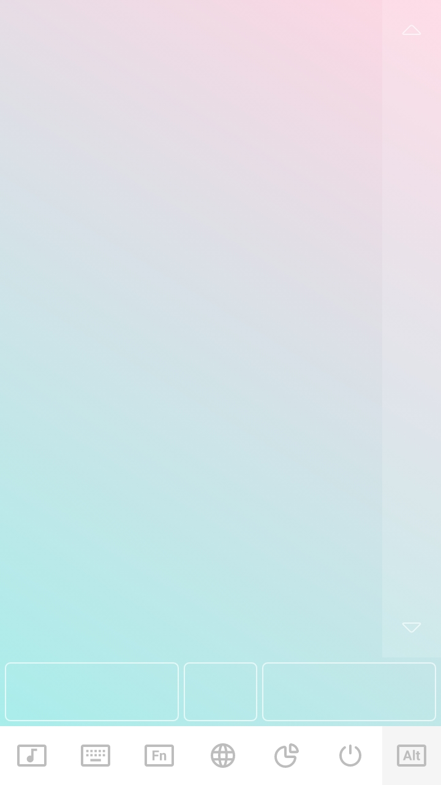

**Чтобы открыть другие модули** управления компьютером, необходимо нажать на одну из иконок внизу экрана. **Чтобы скрыть панель модуля**, необходимо повторно нажать на иконку выбранного модуля.

Первая иконка открывает **модуль управления воспроизведением медиафайлов**. Данный модуль содержит кнопки **переключения треков** на следующий и предыдущий, кнопку **«пуск/пауза»**, кнопку **включения беззвучного режима**, а также кнопку **полной остановки звуковой дорожки**. **Для регулировки громкости** был разработан специальный круговой компонент. При перемещении ползунка по часовой стрелке громкость будет возрастать, а при перемещении его в обратном направлении – убывать. По центру отображается текущее значение громкости звука. После завершения перемещения ползунка оно скрывается и снова появляется кнопка «пуск/пауза».

 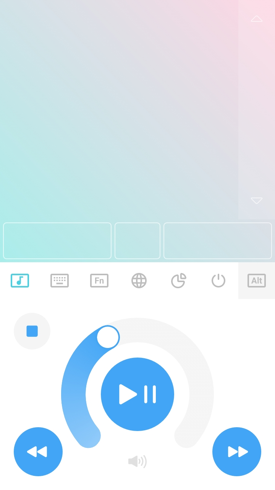
 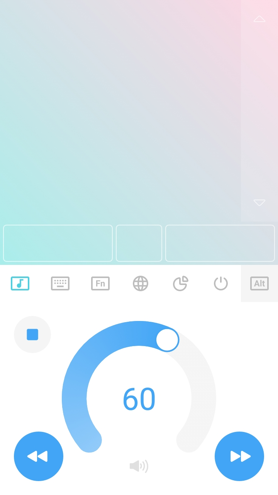

Чтобы **ввести символы в активное поле на экране компьютера**, необходимо переключиться на вторую вкладку. Здесь автоматически появляется стандартная клавиатура Android. Нажатие символа сразу отправляется на экран компьютера, а также выводится по центру поля тачпада. При этом выводимый текст на касания не реагирует, их по-прежнему будет обрабатывать модуль управления действиями мыши. Поэтому, даже если всё поле заполнено текстом, перемещать курсор или выполнять клики можно будет беспрепятственно. Текст стирается при переходе на другую вкладку или при скрытии панели инструментов.

 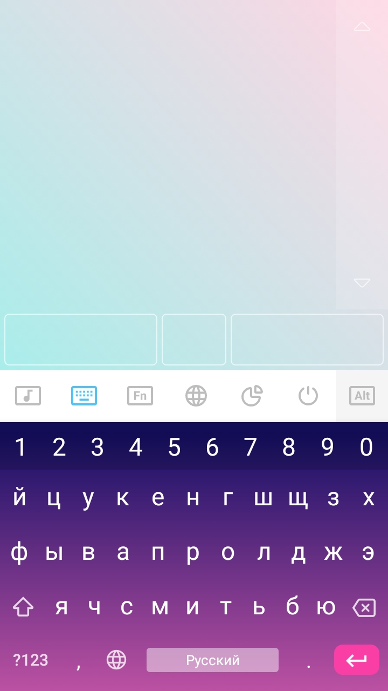
 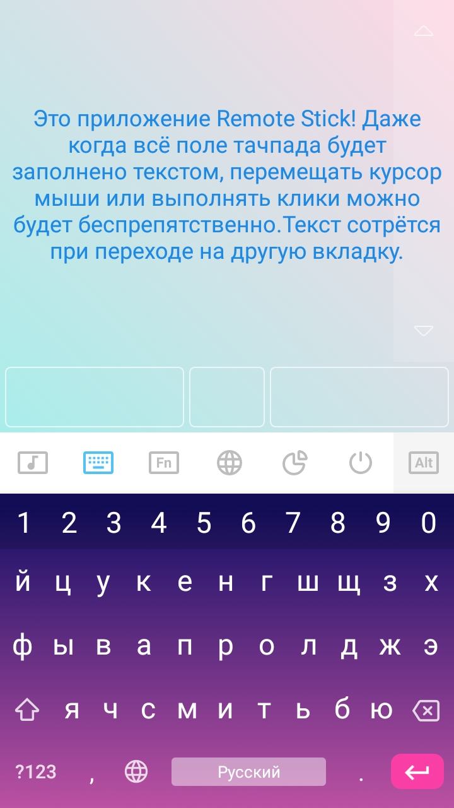

Третья вкладка открывает **модуль специальной клавиатуры**. Здесь расположены все **специальные, функциональные и цифровые клавиши**, а также **клавиши управления курсором**. Также здесь имеются кнопки отправки команд копирования, вставки и отображения рабочего стола (скрытия всех окон). **Чтобы использовать клавиши-модификаторы**, необходимо открыть крайнюю правую вкладку для отображения независимой панели. Здесь, помимо клавиш Ctrl, Shift, Alt и Win, присутствуют кнопки открытия строки поиска и проводника.

 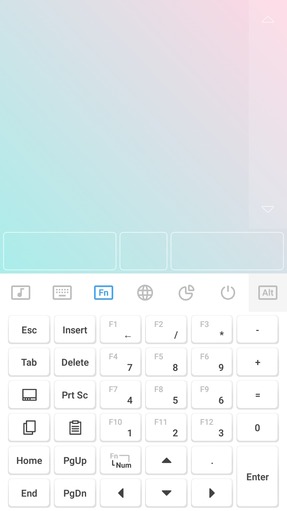
 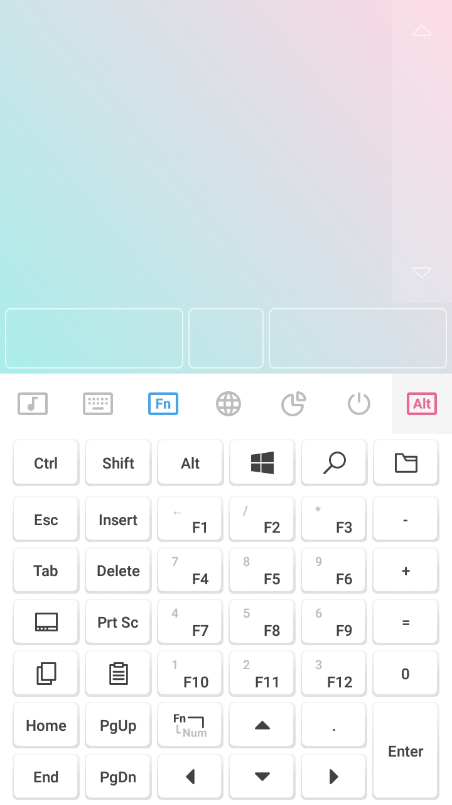
 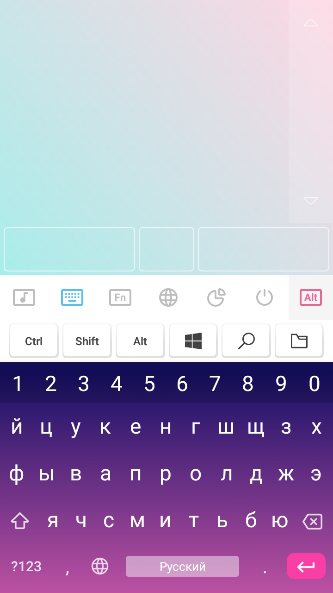

**Чтобы ввести сочетание клавиш**, необходимо последовательно удерживать все клавиши вводимой комбинации, кроме последней, до их выделения, а затем выполнить короткое нажатие последней клавиши. На рисунке ниже представлена отправка сочетания клавиш Ctrl + Shift + N.

 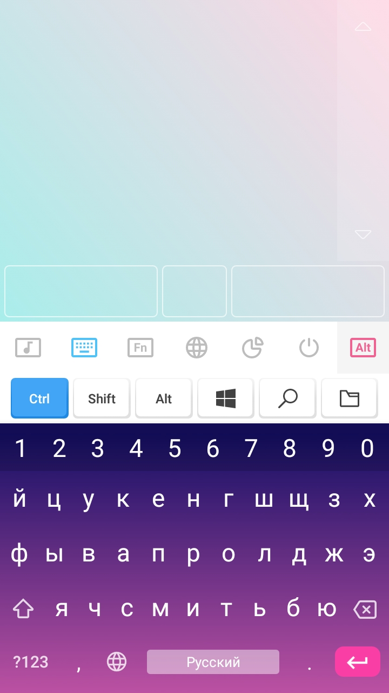
 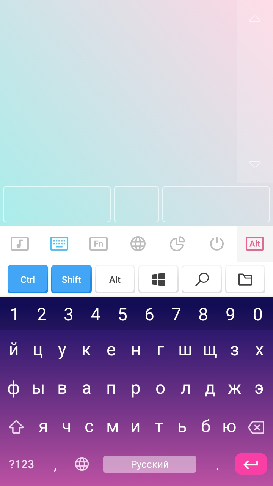
 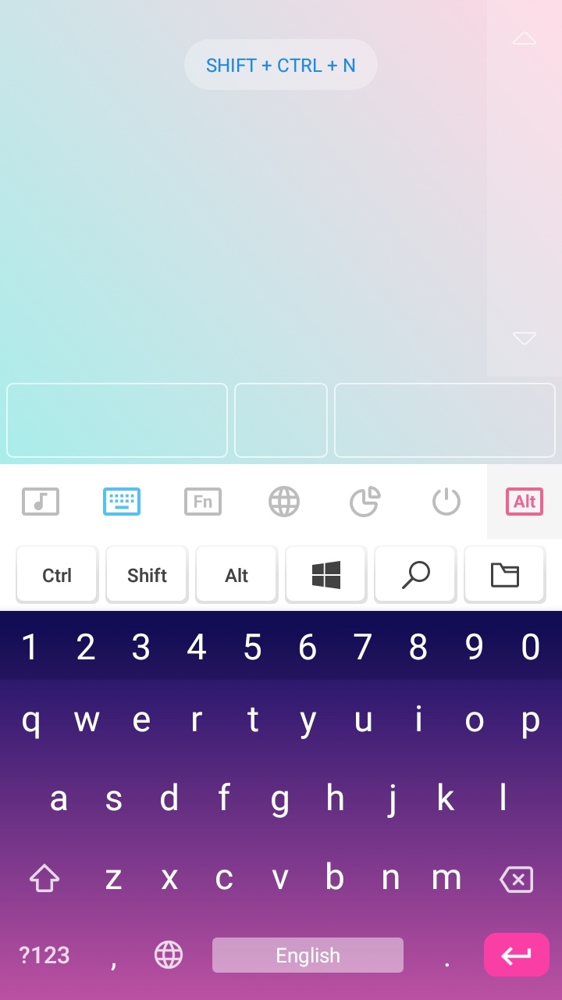

На четвёртой вкладке находится **модуль отправки команд в браузер**. Он содержит кнопки для перемещения по истории вперёд и назад, открытия домашней страницы, обновления, навигации по вкладкам влево и вправо, изменения масштаба, перехода в полноэкранный режим, открытия новой вкладки, закрытия текущей и открытия последней закрытой вкладки.

 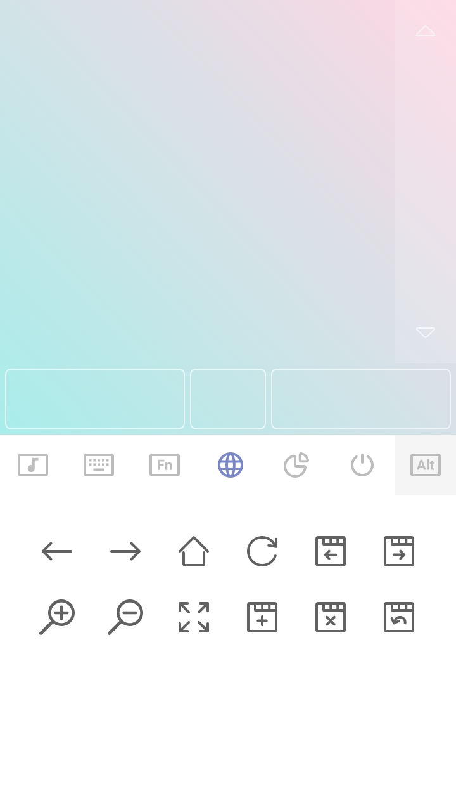

После нажатия пятой вкладки открывается **модуль управления демонстрацией презентаций**. В правом нижнем углу размещены крупные кнопки для перехода по слайдам. Выбор размера и положения этих элементов играет решающую роль при обеспечении удобства управлением демонстрацией. Кнопки запуска показа слайдов сгруппированы в левом верхнем углу. Первая кнопка открывает презентацию с начала, а вторая – с текущего слайда. В правом верхнем углу разместилась кнопка остановки презентации. В левом нижнем углу находится кнопка для отображения яркого кружка-указателя. Повторное нажатие кнопки возвращает системный указатель – стрелку.

 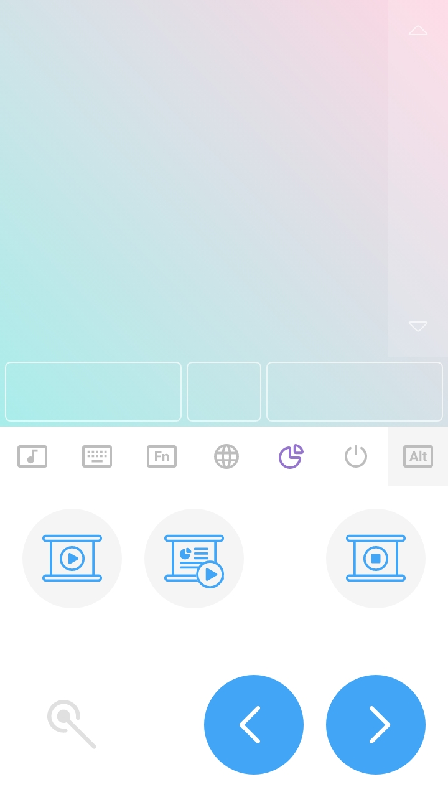

При переходе на шестую вкладку открывается **модуль управления питанием компьютера**. С его помощью можно заблокировать рабочий стол, перевести компьютер в спящий режим и гибернацию, перезагрузить и выключить его полностью. При выполнении двух последних команд работа всех приложений будет корректно завершена, и сервер отправит клиенту пакет отключения.

 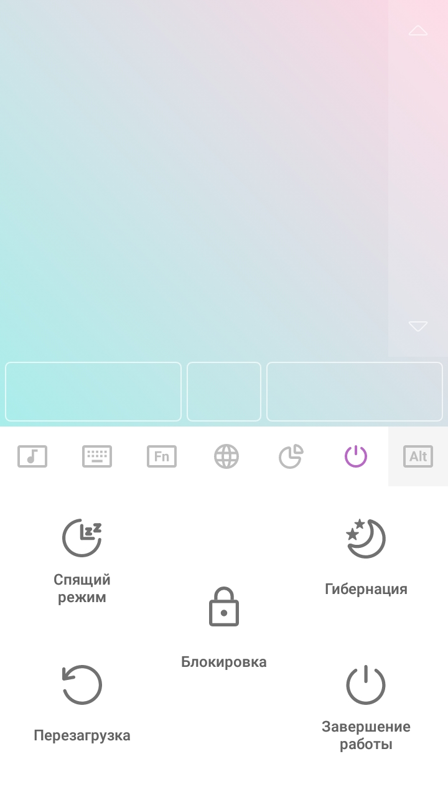

